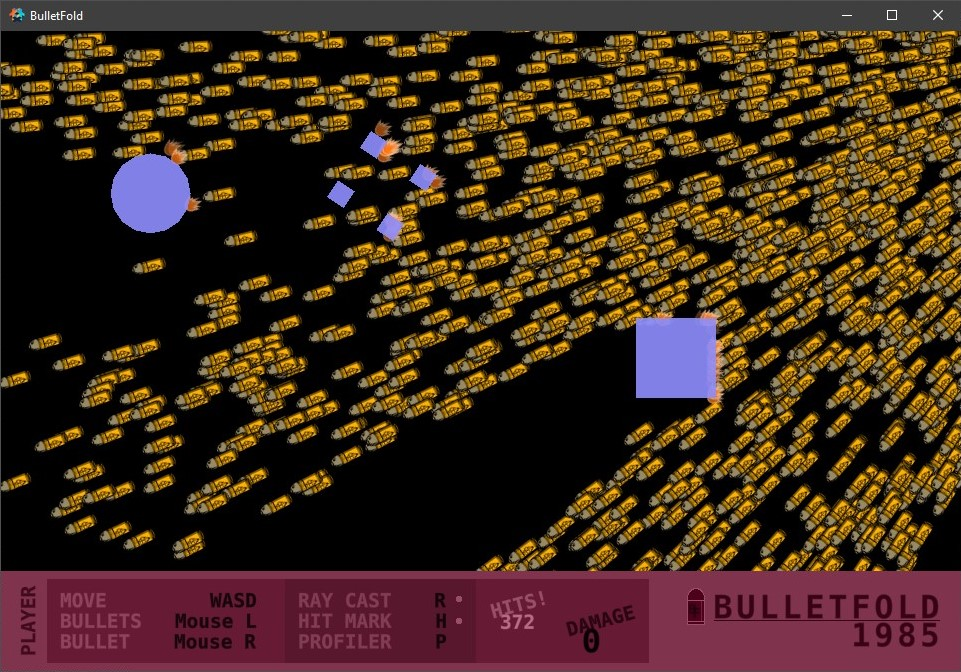

# ***BulletFold***

> Simple, lightweight bullet handler for Defold.

-----



-----

## **Features**

- Single, central Bullet handler module.

- Per Bullet ray casting and Collision Groups.

- Per Bullet hit function and hit marker behaviour.

- Per Bullet update behaviour.

- Two Bullet movement types: handled by [**go.animate()**] or updated using [**go.set()**] (significantly slower).

-----

## **Installation**

*TO DO...*

-----

## **Guide**

*TO DO...*

-----

## **Quick Start**

### *GameObjects*

- **Bullets**: Create a GameObject named "*bullets*" and create a Factory component named "*factory*" within the GameObject.

- **Hit Marker**s: Create a GameObject named "*hit_marker*" and create a Factory component named "*factory*" within the GameObject.

### *Module*

```lua
local bulletfold = require "bulletfold_directory.bulletfold"
```

### *Initialize*

1. Default Bullet Factory:

    ```lua
    bulletfold.factory = "/bullets#factory"
    ```

2. Default Ray Cast Collsion Groups:

    ```lua
    bulletfold.raycast_groups = { hash("collision_group1"), hash("collision_group2") }
    ```

3. Default Hit Marker Function:

    ```lua
    bulletfold.hitmarker = function(position, bullet_id, object_id) --[[ Function ]] end
    ```

    *Parameters*

    - [***position***] `vmath.vector3` The Bullet collision position.

    - [***bullet_id***] `hash` The Bullet GameObject ID.

    - [***object_id***] `hash` The ID of the GameObject the Bullet collided with.

### *Spawn*

- Spawn a Bullet updated using [**go.animate()**] (*Best Performance*):

    ```lua
    bulletfold.spawn(speed, time, position, direction, accuracy, raycast_groups, hit_function)
    ```

    *Parameters*

    - [***speed***] `double` The Bullet speed.

    - [***time***] `double` The Bullet life time.

    - [***position***] `vmath.vector3` The Bullet spawn position.

    - [***direction***] `vmath.vector3` The Bullet travel direction.

    - [***accuracy***] `double` The Bullet accuracy, used to randomize the direction. 0 for perfect accuracy.

    - [***raycast_groups***] `hash table` The Collision Groups the Bullet ray cast can collide with. `bulletfold.raycast_groups` *or* `{ hash("col_group1") }`.

    - [***hit_function***] `function` (**Optional**) The function called when the Bullet hits an object. Default calls the Bullet Hit Marker function and deletes the Bullet.

    *Returns*

    - [***bullet_id***] `hash` The Bullet GameObject ID.

- Spawn a Bullet updated using [**go.set()**] (*Slow*):

    ```lua
    bulletfold.spawn_update(speed, time, position, direction, accuracy, raycast_groups, hit_function)
    ```

    *Parameters*

    - [***speed***] `double` The Bullet speed.

    - [***time***] `double` The Bullet life time.

    - [***position***] `vmath.vector3` The Bullet spawn position.

    - [***direction***] `vmath.vector3` The Bullet travel direction.

    - [***accuracy***] `double` The Bullet accuracy, used to randomize the direction. 0 for perfect accuracy.

    - [***raycast_groups***] `hash table` The Collision Groups the Bullet ray cast can collide with. `bulletfold.raycast_groups` *or* `{ hash("col_group1") }`.

    - [***hit_function***] `function` (**Optional**) The function called when the Bullet hits an object. Default calls the Bullet Hit Marker function and deletes the Bullet.

    *Returns*

    - [***bullet_id***] `hash` The Bullet GameObject ID.

- Custom Hit Functions:

    ```lua
    hit_function = function(position, bullet_id, object_id) hitmarker(position) ; bulletfold.delete(bullet_id) end
    ```

    *Parameters*

    - [***position***] `vmath.vector3` The Bullet collision position.

    - [***bullet_id***] `hash` The Bullet GameObject ID.

    - [***object_id***] `hash` The ID of the GameObject the Bullet collided with.

### *Update*

- Updates the BulletFold buffer.

 ```lua
 bulletfold.update(dt)
 ```

*Parameters*

- [***dt***] `double` The time elapsed since the previous frame.

### *Delete*

- Deletes a Bullet and removes it from the BulletFold buffer.

```lua
bulletfold.delete(bullet_id)
```

*Parameters*

- [***bullet_id***] `hash` The Bullet GameObject ID.

-----

## Credits

BulletFold is based on [DefBullet](https://github.com/subsoap/defbullet) by [SubSoap](https://github.com/subsoap).
