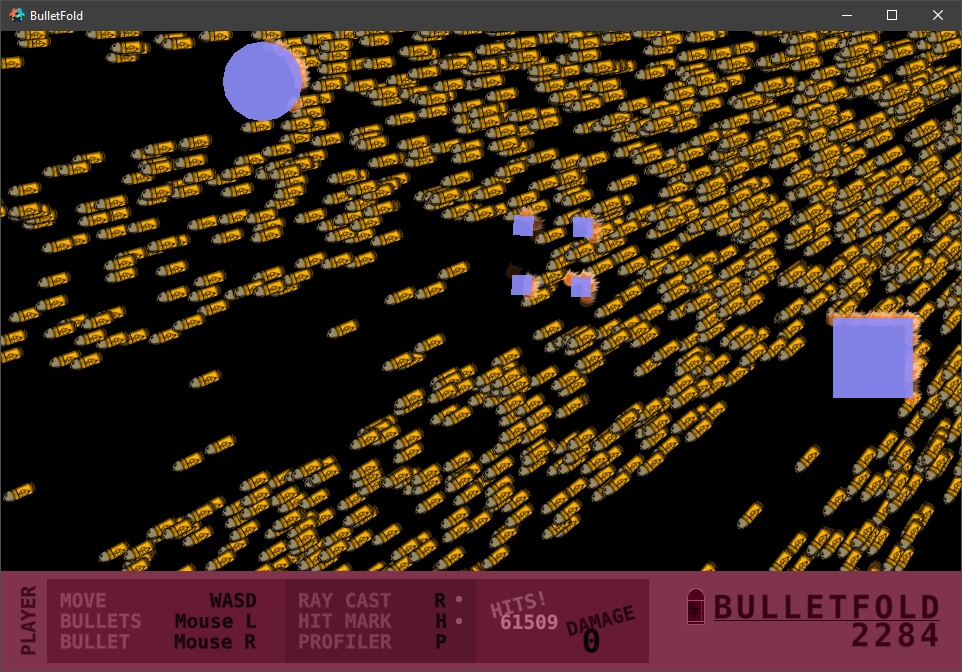

# ***BulletFold***

> Simple, lightweight bullet handler for Defold.

-----

-----

## **Features**

- Per Bullet ray casting and Collision Groups.

- Per Bullet hit function behaviour.

- Per Bullet update behaviour.

- Multiple Bullet update functions based on spawn parameters.

- Two Bullet movement types: handled by [go.animate()] or updated using [go.set()] (significantly slower).

-----

## **Installation**

*TO DO...*

-----

## **Quick Setup**

### *Module*

- `local bulletfold = require "bulletfold_directory.bulletfold"`

### *Initialize*

- Default Bullet Factory: `bulletfold.factory = "/bullets#factory"`

- Default Ray Cast Collsion Groups: `bulletfold.raycast_groups = { hash("collision_group1"), hash("collision_group2") }`

- Default Hit Marker Function: `bulletfold.hitmarker = function(position, bullet_id, object_id) --[[ Function ]] end`

### *Spawn*

- `local bullet_id = bulletfold.spawn(speed, time, position, direction, accuracy, bulletfold.raycast_groups, custom_hit_function)`

- `bulletfold.spawn(speed, time, position, direction, accuracy, { hash("custom_group1") }, custom_hit_function)`

### *Update*

- `bulletfold.update(dt)`

### *Delete*

- `bulletfold.delete(bullet_id)`
