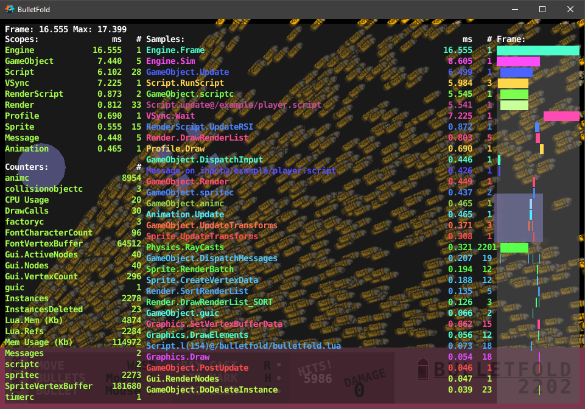

# ***BulletFold***

> Simple, lightweight bullet handler for Defold.

-----




-----

## **Features**

- Central Bullet handler module.

- Per Bullet ray casting and Collision Groups.

- Per Bullet hit response functions and hit marker functions.

- Per Bullet update behaviour.

- Two Bullet movement types: handled by [**go.animate()**] or updated using [**go.set()**] (significantly slower).

-----

## **Installation**

*TO DO...*

-----

## **Guide**

*TO DO...*

-----

## **Quick Start**

Please see the **[quick_start.script_snippet](quick_start.script_snippet)** for a basic implementation.

### *GameObjects*

- **Bullets**: Create a GameObject named "*bullets*" and create a Factory component named "*factory*" within the GameObject.

- **Hit Markers**: Create a GameObject named "*hit_markers*" and create a Factory component named "*factory*" within the GameObject.

### *Module*

```lua
local bulletfold = require "bulletfold_directory.bulletfold"
```

### *Initialize*

1. Default Bullet Factory:

    ```lua
    bulletfold.factory = "/bullets#factory"
    ```

2. Default Ray Cast Collsion Groups:

    ```lua
    bulletfold.raycast_groups = { hash("collision_group1"), hash("collision_group2") }
    ```

3. Default Hit Marker Function:

    ```lua
    bulletfold.hitmarker = function(position, bullet_id, object_id) --[[ Function ]] end
    ```

    *Parameters*

    - [***position***] `vmath.vector3` The Bullet collision position.

    - [***bullet_id***] `hash` The Bullet GameObject ID.

    - [***object_id***] `hash` The ID of the GameObject the Bullet collided with.

### *Spawn*

```lua
bulletfold.spawn(speed, time, position, direction, accuracy, raycast_groups, factory, hit_response)
```

- Spawn a Bullet updated using [**go.animate()**] (*Best Performance*):

    *Parameters*

    - [***speed***] `double` The Bullet speed.

    - [***time***] `double` The Bullet life time, in seconds.

    - [***position***] `vmath.vector3` The Bullet spawn position.

    - [***direction***] `vmath.vector3` The Bullet travel direction.

    - [***accuracy***] `double` The Bullet accuracy, used to randomize the direction. 0 for perfect accuracy.

    - [***raycast_groups***] `hash table` (**Optional**) The Collision Groups the Bullet ray cast can collide with. `nil` to disable ray casting.

    - [***factory***] `string` (**Optional**) The URL string of the Factory component used to spawn the Bullet GameObject. Default is the BulletFold Factory.

    - [***hit_response***] `function` (**Optional**) The function called when the Bullet hits an object. Default calls the Bullet Hit Marker function and deletes the Bullet.

    *Returns*

    - [***bullet_id***] `hash` The Bullet GameObject ID.

```lua
bulletfold.spawn_update(speed, time, position, direction, accuracy, raycast_groups, factory, hit_response)
```

- Spawn a Bullet updated using [**go.set()**] (*Slower, Full Control Over Movement*):

    *Parameters*

    - [***speed***] `double` The Bullet speed.

    - [***time***] `double` The Bullet life time, in seconds.

    - [***position***] `vmath.vector3` The Bullet spawn position.

    - [***direction***] `vmath.vector3` The Bullet travel direction.

    - [***accuracy***] `double` The Bullet accuracy, used to randomize the direction. 0 for perfect accuracy.

    - [***raycast_groups***] `hash table` (**Optional**) The Collision Groups the Bullet ray cast can collide with. `nil` to disable ray casting.

    - [***factory***] `string` (**Optional**) The URL string of the Factory component used to spawn the Bullet GameObject. Default is the BulletFold Factory.

    - [***hit_response***] `function` (**Optional**) The function called when the Bullet hits an object. Default calls the Bullet Hit Marker function and deletes the Bullet.

    *Returns*

    - [***bullet_id***] `hash` The Bullet GameObject ID.

```lua
hit_response = function(bullet_id, result) hitmarker(result.position) ; bulletfold.delete(bullet_id) end
```

- Custom Bullet hit response function:

    *Parameters*

    - [***bullet_id***] `hash` The Bullet GameObject ID.

    - [***result***] `table` The result of the Bullet ray cast collision.

        - [***normal***] `vmath.vector3` The surface normal of the Collision Object the Bullet collided with.

        - [***fraction***] `double` The fraction along the ray cast where the collision occured. 0 is the start, 1 is the end.

        - [***position***] `vmath.vector3` The collision position.

        - [***group***] `hash` The Collision Group ID of the Collision Object.

        - [***id***] `hash` The ID of the GameObject the Bullet collided with.

### *Update*

```lua
bulletfold.update(dt)
```

- Updates the BulletFold buffer.

    *Parameters*

    - [***dt***] `double` The time elapsed since the previous frame.

### *Delete*

```lua
bulletfold.delete(bullet_id)
```

- Deletes a Bullet and removes it from the BulletFold buffer.

    *Parameters*

    - [***bullet_id***] `hash` The Bullet GameObject ID.

```lua
bulletfold.clear()
```

- Deletes every Bullet from the BulletFold buffer.

-----

## Credits

BulletFold is based on [DefBullet](https://github.com/subsoap/defbullet) by [SubSoap](https://github.com/subsoap).
